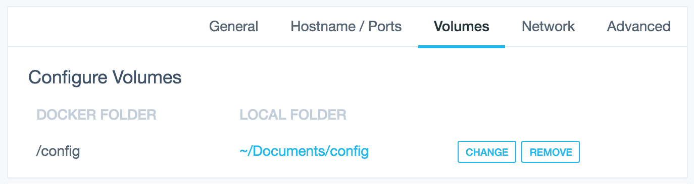

docker-creepminer
=================

Out-of-the-box creepMiner github build running in Ubuntu 16.04.4

## Usage

Start your image binding the external ports 8124 and 9001 to all interfaces to your container:
```
docker run -d -p 8124:8124 -p 9001:9001 whumphrey/creepminer
```

By default the miner uses a default config `/usr/local/sbin/miner.config` for testing purposes. Please use your own [`miner.confg`](https://github.com/Creepsky/creepMiner/wiki/Sample-mining.conf). The default `miner.confg` connects to the 0-100 pool and uses the PoC Consortium wallet. It has no plot locations and logging is disabled as this container logs to the console using Supervisor (A Process Control System)

If you wish to use a config please map the `/config` volume to a local folder and place your [`miner.confg`](https://github.com/Creepsky/creepMiner/wiki/Sample-mining.conf) in that local folder.


Please see docker's [Use volumes](https://docs.docker.com/storage/volumes/) for more details.

## Connecting to the creepMiner server

Interface | URL and Port
------------ | -------------
creepMiner | [http://docker_ip:8124](http://127.0.0.1:8124)
supervisord | [http://docker_ip:9001](http://127.0.0.1:9001)

### Quick setup - TBD



